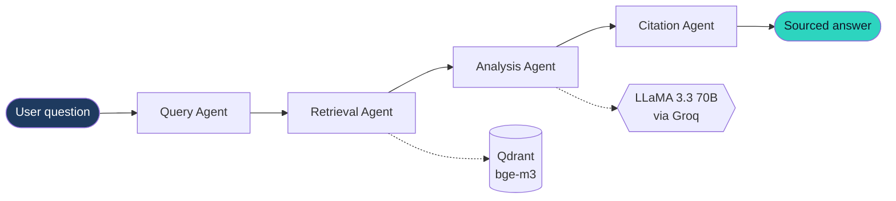

<div align="center">


<br/><br/>


[](https://linkedin.com/in/ikram-saidane)
[](mailto:ikram.saidane@dauphine.eu)

</div>

---

## About me

```python
class IkramSaidane:
    role     = "Future AI Engineer"
    studying = "M2 AI, Data Science & Agentic AI @ Paris Dauphine"
    focus    = ["GenAI", "RAG", "Multi-agent systems", "MLOps"]
    speaks   = ["Arabic", "French", "English", "German (A1)"]
    seeking  = "6-month PFE internship · from Feb 2027 · France"

    def currently_building(self):
        return "Agora: EU regulatory watch powered by AI agents"

    def motto(self):
        return "Reliable AI is evaluated, deployed, and explainable."
```

---

## Featured project: Agora

**Multi-agent EU regulatory watch** on the EUR-Lex corpus (AI Act, GDPR, DSA, DMA).



| Faithfulness | Answer relevancy | Context precision | Context recall |
|:---:|:---:|:---:|:---:|
|  |  |  |  |

`LangGraph` · `RAG` · `Qdrant` · `bge-m3` · `LLaMA 3.3` · `Groq` · `RAGAS`

[](https://github.com/Ikram-Saidane/agora)

---

## More projects

<table>
<tr>
<td width="50%" valign="top">

### Churn Prediction API
End-to-end **MLOps** pipeline on IBM Telco (7,043 customers).

**AUC 0.840**
FastAPI · Docker · GitHub Actions · Railway

[Explore](https://github.com/Ikram-Saidane/churn-prediction-api)

</td>
<td width="50%" valign="top">

### House Price Prediction
Kaggle **Ames Housing** competition.

**Rank 58 out of 5,235 teams**
XGBoost · LightGBM · CatBoost · Stacking

[Explore](https://github.com/Ikram-Saidane/house-price-prediction)

</td>
</tr>
</table>

<details>
<summary><b>Even more projects</b></summary>
<br/>

- **Hotel cancellation prediction**: SMOTE, SHAP/LIME, AUC 0.915
- **Tourism flow forecasting in Tunisia**: Random Forest, MLP, LSTM
- **PRIMIA**: EY hackathon

</details>

---

## Tech stack

<div align="center">

[](https://skillicons.dev)


</div>

| GenAI & Agentic AI | Machine Learning | MLOps & Tools |
|---|---|---|
| RAG, LLaMA 3.x | scikit-learn, XGBoost | FastAPI, Docker |
| LangChain, LangGraph | LightGBM, CatBoost | GitHub Actions (CI/CD) |
| Embeddings (bge-m3, MiniLM) | Stacking, feature engineering | Railway, GCP |
| Qdrant, Groq API | Deep Learning (MLP, LSTM), NLP | Streamlit, Git, Linux |
| RAGAS evaluation | SHAP / LIME | SQL |

---

## Journey

```
2025 - now     M2 AI, Data Science & Agentic AI · Paris Dauphine
2025           Capgemini Engineering · GenAI/RAG PFE internship (Très Bien)
2023 - 2024    Dreamtek Consulting · Web development (Symfony)
2021 - 2025    BSc Software Engineering · ISTIC
```

- **Capgemini Engineering**: end-to-end RAG pipeline (ingestion, chunking, MiniLM, LLaMA 3.1, LangChain), automated RAGAS evaluation, Streamlit demo.
- **DataIn**: IT & training lead, co-organizer of the **DauphineXey** hackathon.

---

## GitHub activity

<div align="center">


<br/>

<picture>
  <source media="(prefers-color-scheme: dark)" srcset="https://raw.githubusercontent.com/Ikram-Saidane/Ikram-Saidane/output/github-snake-dark.svg" />
  <source media="(prefers-color-scheme: light)" srcset="https://raw.githubusercontent.com/Ikram-Saidane/Ikram-Saidane/output/github-snake.svg" />
  
</picture>

</div>

---

<div align="center">

### Let's work together

I'm looking for a **6-month PFE internship in France** (AI Engineering, GenAI, ML, Data Science).

[](mailto:ikram.saidane@dauphine.eu)
[](https://linkedin.com/in/ikram-saidane)


</div>
